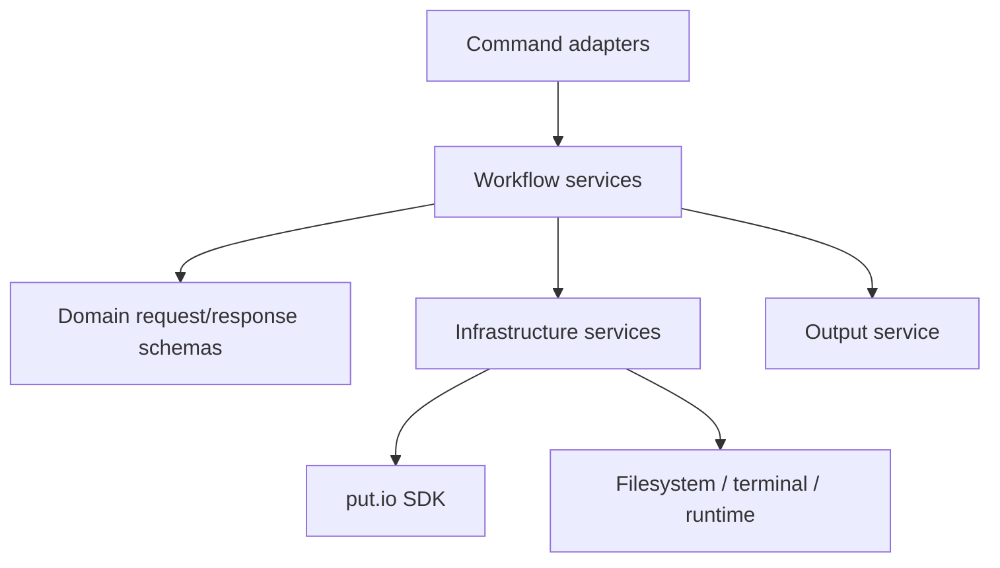

# CLI Architecture

This repository is being refactored toward an agent-first, deeply Effect-native CLI.

## North Star

- Thin `@effect/cli` command adapters
- Explicit services and layers for runtime, output, config, state, SDK access, and workflows
- Schema-backed request and response boundaries
- Tagged errors for recoverable failures
- Machine-readable contracts that are useful for both scripts and AI agents

## Runtime Shape

## Layer Responsibilities

### Command adapters

- Parse flags and raw payload input
- Decode external input into typed requests
- Invoke workflows
- Select output mode

### Workflow services

- Own orchestration and business intent
- Depend on services through Effect layers
- Return typed results and tagged errors

### Infrastructure services

- Runtime and terminal capabilities
- Output rendering and structured writes
- Config resolution and persisted state
- Authenticated and unauthenticated SDK access

## Invariants

- `Effect.run*` stays at app and test edges.
- External data is parsed once at the boundary, then trusted internally.
- Commands stay thin enough that workflow tests are more important than command-internal tests.
- Structured output remains stable enough for scripts and agents.
- Human-friendly terminal rendering is an adapter, not the source of truth.

## Agent-First Contract

- Every command should have structured output.
- Mutating commands should grow raw JSON payload input and dry-run support.
- Read commands should grow field-selection and pagination controls.
- Machine-readable introspection should describe command purpose and capabilities without relying on prose docs.
- Repo docs should explain the architecture and guardrails in formats agents can consume quickly.

## Current Phase

The current CLI contract already includes:

- schema-backed `describe` metadata for command purpose, capabilities, flags, and raw JSON payload shapes
- raw `--json` input and `--dry-run` on mutating commands
- `--fields` on agent-relevant read commands
- cursor-backed `--page-all` on `files list`, `files search`, `search`, and `transfers list`
- shared hardening for field selectors and identifier-like inputs before API calls

Next architectural work can keep extracting deeper services and workflows without losing the agent-first CLI surface.
