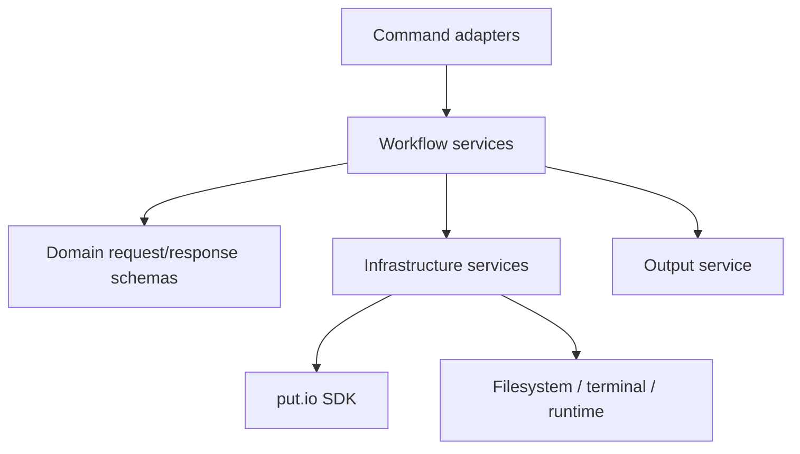

# CLI Architecture

This repository is being refactored toward an agent-first, deeply Effect-native CLI.

## North Star

- Thin Effect CLI command adapters from `effect/unstable/cli`
- Explicit services and layers for runtime, output, config, state, SDK access, and workflows
- Schema-backed request and response boundaries
- Tagged errors for recoverable failures
- Machine-readable contracts that are useful for both scripts and AI agents

## Runtime Shape

```mermaid
flowchart TD
  A["Command adapters"] --> B["Workflow services"]
  B --> C["Domain request/response schemas"]
  B --> D["Infrastructure services"]
  D --> E["put.io SDK"]
  D --> F["Filesystem / terminal / runtime"]
  B --> G["Output service"]
```

## Layer Responsibilities

### Command adapters

- Parse flags and raw payload input
- Decode external input into typed requests
- Invoke workflows
- Select output mode

### Workflow services

- Own orchestration and business intent
- Depend on services through Effect layers
- Return typed results and tagged errors

### Infrastructure services

- Runtime and terminal capabilities
- Output rendering and structured writes
- Config resolution, profile-aware auth selection, and persisted state
- SDK access through the SDK-owned live layer and portable fetch transport

## Invariants

- `Effect.run*` stays at app and test edges.
- External data is parsed once at the boundary, then trusted internally.
- Commands stay thin enough that workflow tests are more important than command-internal tests.
- Structured output remains stable enough for scripts and agents.
- Human-friendly terminal rendering is an adapter, not the source of truth.

## Crash-reporting policy

### Decision

External crash reporting is approved as a bounded, enabled-by-default diagnostic sent to the
dedicated `putio/putio-cli` Sentry project. The project is US-hosted, uses the Node platform, and
is owned by the Sentry `frontend` team. It is operational diagnostics, not product analytics.

`putio telemetry disable` persists the only user preference as `telemetry_disabled: true` in the
normal private CLI config. `putio telemetry enable` removes that field, and `putio telemetry status`
reports the preference without authentication. Startup reads only that boolean before initializing
Sentry. A missing config keeps the default enabled; an unreadable, invalid, or unexpected config
fails closed and disables reporting. Released npm and standalone artifacts receive a validated DSN
at build time. Source and pull-request builds omit it and fail closed without initializing Sentry or
installing crash handlers. The same enabled default applies in CI, agents, and other non-interactive
execution when the artifact contains release configuration.
`DO_NOT_TRACK` is not a separate control; those environments use the same persisted
`putio telemetry disable` preference and config-path precedence. Online and offline command
behavior is otherwise identical.

### Failure boundary

Expected typed Effect, CLI, SDK, and API failures remain ordinary command errors. Unexpected
Effect defects, uncaught exceptions, and unhandled rejections are eligible for one synthetic event
per process when reporting is enabled. The local error is rendered through stderr first for Effect defects.
Global handlers remove themselves after the first fatal event, perform a bounded flush, and replay
the original uncaught exception or rejection to Node. Stdout remains reserved for command results,
ordinary failures keep exit status 1, and interrupt-only causes continue to the Node runtime so
their signal semantics are preserved.

Capture and flush failures are discarded. The flush deadline is 250 milliseconds, with no retry.
Reporting never replaces the original local error or delays termination beyond that bound.

### Data and operations

Events are built from an allowlist and then projected through the same allowlist immediately before
transport. The transport accepts only the one expected event ID and failure category, drops
SDK-internal or malformed envelopes, and rebuilds the serialized envelope rather than forwarding
SDK output. The transmitted event contains a random event ID and timestamp, fixed message and
component/platform labels, one of three fixed failure-category tags, the fixed `production`
environment, fixed fatal level, logger, and message/category fingerprint, and package release
`@putdotio/cli@<version>`. The Sentry envelope also carries the public DSN routing metadata required
by the provider.

The original error, message, and stack are never passed to Sentry. Events also exclude tokens,
profiles, environment variables, configuration values, command names and arguments, API bodies,
URLs, paths, filenames, full payloads, untrusted server text, breadcrumbs, device identifiers,
and user identifiers. Default Sentry integrations, client reports, logs, tracing, server-name
detection, PII capture, breadcrumbs, and stack attachment are disabled. Because no stack is sent,
this integration has no source-map upload.

The release workflow reads `PUTIO_CLI_SENTRY_DSN` from the protected `release` GitHub Environment,
validates it as an HTTPS Sentry DSN, and injects it into npm and standalone builds. Release builds
fail when that value is missing or invalid. The DSN remains a public project-routing key embedded in
the resulting artifacts; Sentry auth and admin tokens remain outside the repository and release
artifacts. The `frontend` team owns the project and manual support path. Events inherit the put.io
Sentry organization's current retention contract and are used only for debugging, not product
analysis. Removal requests go through the private contact in SECURITY.md; `putio telemetry disable`
prevents future events but does not itself delete an already delivered event.

Local diagnosis should use the CLI version, installation method, operating-system name,
interactive/CI/non-interactive context, command name and output mode, and the smallest useful
sanitized stderr excerpt. It must not include command arguments or any of the excluded data above.
Sensitive reports and deletion requests go to the private security contact.

## Agent-First Contract

- Every command should have structured output.
- Mutating commands should grow raw JSON payload input and dry-run support.
- Read commands should grow field-selection and pagination controls.
- Machine-readable introspection should describe command purpose and capabilities without relying on prose docs.
- Structured renderers should redact sensitive values and mark prompt-injection-like API text as untrusted data.
- Repo docs should explain the architecture and guardrails in formats agents can consume quickly.

## Current Phase

The current CLI contract already includes:

- schema-backed `describe` metadata for command purpose, capabilities, flags, and raw JSON payload shapes
- neutral automation metadata in `describe` for supported output, dry-run, raw JSON input, field-selection, streaming, and safety features
- raw `--json` input and `--dry-run` on mutating commands
- named auth profiles with env/default-profile selection and legacy single-token fallback
- `--fields` on agent-relevant read commands
- cursor-backed `--page-all` on `files list`, `files search`, `search`, and `transfers list`
- shared hardening for field selectors and identifier-like inputs before API calls
- structured output redaction plus `_meta.agentSafety.untrustedTextPaths` annotations for prompt-injection-like API text
- a versioned consumer skill library in `skills/putio-cli` with surface guides for discovery, auth/device approval, reads, writes, guardrails, and OpenAI/Codex picker metadata

Next architectural work can keep extracting deeper services and workflows without losing the agent-first CLI surface.
